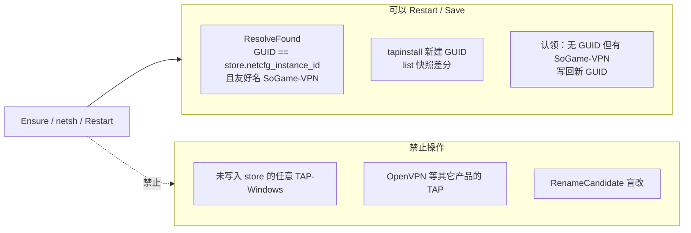
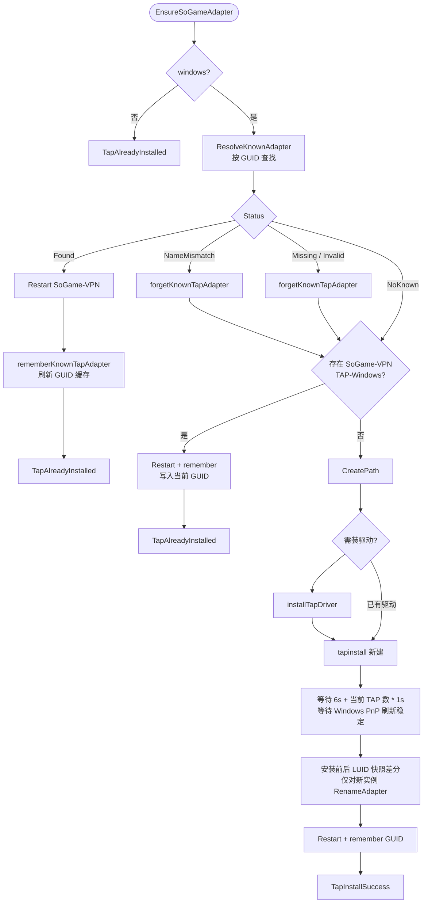
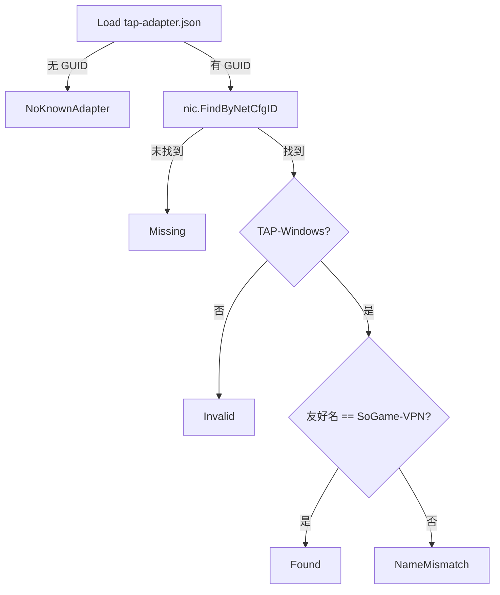
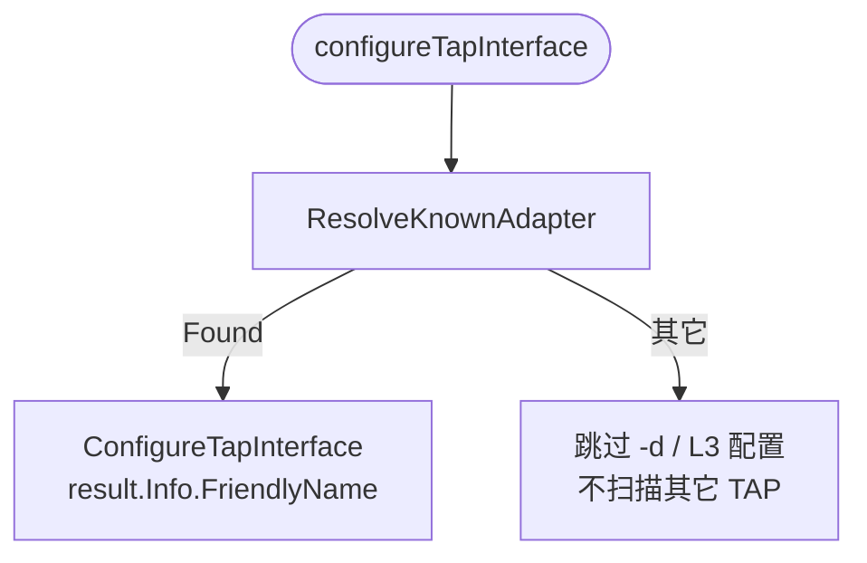
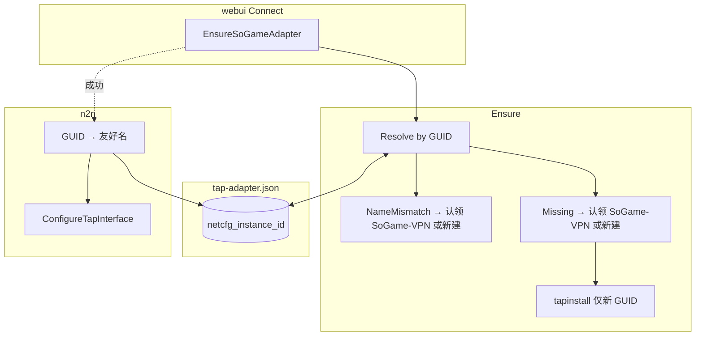

# TAP「只动自己网卡」策略

本文档描述 SoGame 在 Windows 上当前实现的 TAP 选卡、安装、认领和调用边界，可独立用于代码审查，不依赖其它架构文档。

---

## 1. 目标与原则

### 1.0 术语

| 术语 | 含义 |
|------|------|
| `SoGame-VPN` | SoGame 专属 TAP 的 Windows 友好名。正常成功路径要求最终存在且只存在这一张同名 TAP。 |
| TAP-Windows | `Description` 匹配 TAP-Windows 的虚拟网卡类型。其它软件也可能创建同类网卡。 |
| NetCfgInstanceId / GUID | Windows 网络设备实例 GUID。作为 SoGame 持久化和运行时定位的主键。 |
| LUID | Windows 接口运行时标识，只作为查询和调试缓存，不作为持久化主键。 |
| store | `%AppData%/SoGame/tap-adapter.json`，记录 SoGame 上次确认成功的 TAP GUID 和缓存字段。 |
| 外部 TAP | 系统中存在但既不是 store GUID 命中、也不叫 `SoGame-VPN` 的 TAP-Windows。SoGame 不主动认领或改名。 |

### 1.1 产品约束

- **不得占用其它软件的 TAP/TUN**：禁止按 Description 扫描第一块 TAP-Windows 并改名为 `SoGame-VPN`（无 `RenameCandidate` 盲改路径）。
- **持久化主键为 NetCfgInstanceId（GUID）**，不是 LUID：
  - GUID 在设备生命周期内稳定；
  - LUID、友好名仅作**缓存字段**，写入 json 便于调试，运行时以 GUID 解析为准。
- **只操作「自己的」网卡**，认定来源仅两类：
  1. **`tap-adapter.json` 中记录的 GUID**（上次 Ensure 成功写入）；
  2. **`tapinstall` 本次新建实例**（安装前后 `nic.List` 差分 → 只改名新增 TAP → 写入 store）。
- **友好名 `SoGame-VPN`**：专属名；Windows 下全局唯一。

### 1.2 三条核心决策（已定）

| 情况 | 行为 |
|------|------|
| **GUID 命中，友好名仍是 `SoGame-VPN`** | 只 Restart 该网卡，更新 store 缓存字段 |
| **GUID 命中，友好名不是 `SoGame-VPN`** | 视为可能被其它程序改名使用 → **forget store → 优先认领 `SoGame-VPN`，否则新建 TAP**（不对该 GUID 抢改名） |
| **GUID 未命中（Missing/Invalid），但存在友好名 `SoGame-VPN` 的 TAP-Windows** | **直接认领该网卡**，Restart 后 **用当前 GUID 更新 store**（系统不允许两张同名网卡，故该名可视为本应用专属口） |
| **GUID 未命中，且无 `SoGame-VPN`** | 安装驱动（如需）→ `tapinstall` 新建 → 仅对新实例改名 → 写 GUID |

### 1.3 组件职责

| 组件 | 职责 |
|------|------|
| `internal/tap/store` | 读写 `%UserConfigDir%/SoGame/tap-adapter.json`；**主字段 `netcfg_instance_id`** |
| `internal/tap/resolve` | `FindByNetCfgID` → 校验 TAP-Windows + 友好名是否为 `SoGame-VPN` |
| `platform.EnsureSoGameAdapter` | 编排 §1.2 三条决策 + 新建 |
| `n2n` / `ConfigureTapInterface` | Ensure 成功后按 **GUID → 当前友好名** 配 L3，不扫描其它 TAP |

### 1.4 运行时与安装包边界

| 阶段 | 行为 |
|------|------|
| 安装包 | 只复制 `SoGame.exe`、`edge.exe` 和 `{app}\tap` 下的 TAP 驱动资产；不再运行 `install_tap.bat`。 |
| 首次连接 | `webui.Connect` 调用 `EnsureSoGameAdapter`，由程序运行时按需执行 `pnputil` 和 `tapinstall`。 |
| 后续连接 | 优先通过 store GUID 找回 `SoGame-VPN`，重启并刷新 store。 |

TAP 驱动资产应随安装包放入：

```text
{app}\tap\OemWin2k.inf
{app}\tap\tap0901.cat
{app}\tap\tap0901.sys
{app}\tap\tapinstall.exe
```

---

## 2. 什么算「自己的」网卡



---

## 3. `tap-adapter.json` 字段

```json
{
  "netcfg_instance_id": "{GUID}",
  "luid": 12345,
  "friendly_name": "SoGame-VPN",
  "description": "TAP-Windows Adapter V9",
  "updated_at": "2026-06-03T12:00:00Z"
}
```

| 字段 | 用途 |
|------|------|
| **`netcfg_instance_id`** | **主键**；Resolve / Ensure 定位网卡 |
| `luid` | 缓存；便于日志；可通过 `nic.LuidFromNetCfgID` 刷新 |
| `friendly_name` | 缓存；**运行时以 GUID 查得的当前名为准** |
| `description` | 缓存；辅助校验 TAP-Windows |

旧版仅含 `luid` 的记录：首次 Resolve 时可按 LUID 找到网卡并 **升级写入 GUID**；之后只认 GUID。

---

## 4. Ensure 契约

`EnsureSoGameAdapter` **成功**应保证：

1. store 中存在有效 **`netcfg_instance_id`**；
2. 该 GUID 对应网卡存在，且为 TAP-Windows、友好名为 **`SoGame-VPN`**；
3. 已对该口执行 `RestartTapInterface`；
4. store 缓存字段（LUID、友好名等）已更新。

**失败则 Connect 不启动 edge**。重启失败、store 写入失败、创建后验证不到 `SoGame-VPN` 都会返回 `TapInstallFailed`。

---

## 5. `EnsureSoGameAdapter` 当前流程



### 5.1 禁止路径

| 路径 | 目标 |
|------|------|
| `RenameCandidate` / 按 Description 盲改 | **删除** |
| GUID 命中但友好名不对 → 对该 GUID `RenameAdapter` | **禁止**；改走认领或新建 |
| `FindAdapter` 回落任意 TAP-like | **删除** |

### 5.2 GUID 命中但友好名已变（NameMismatch）

```text
store GUID = {AAA...}
系统中该 GUID 仍在，但友好名 = "OpenVPN TAP"（不是 SoGame-VPN）
```

**解读**：本应用曾绑定的设备被改名，很可能正被其它程序使用。

**行为**：

1. `forgetKnownTapAdapter`（作废旧绑定）；
2. **不**对该 GUID 执行 Rename；
3. 若系统已有 `SoGame-VPN` → 走 **认领**（§5.3）；
4. 否则 → **tapinstall 新建**。

### 5.3 GUID 丢失但 `SoGame-VPN` 存在（认领）

```text
store 无 / GUID Missing（设备重装、json 删、GUID 变等）
系统中仍有一块 TAP-Windows 叫 SoGame-VPN
```

**解读**：Windows 不允许重名；叫 `SoGame-VPN` 的 TAP 即本应用专属口（或历史安装遗留的本应用口）。

**行为**：

1. `FindWindowsAdapterByFriendlyName("SoGame-VPN")`；
2. Restart；
3. `nic.NetCfgIDFromLuid` → **写入 store 作为主键**（更新 GUID）。

**不做**：为「找 GUID」去改其它 TAP 的名。

---

## 6. `ResolveKnownAdapter` 状态



| Status | Ensure 动作 |
|--------|-------------|
| `Found` | Restart + remember |
| `NameMismatch` | forget → 认领或新建 |
| `Missing` / `Invalid` | forget → 认领或新建 |
| `NoKnownAdapter` | 认领或新建 |

---

## 7. edge 与 L3 配置

### 7.1 调用顺序

```text
webui Connect
  → EnsureSoGameAdapter()   // 成功 ⇒ store 有 GUID 且口为 SoGame-VPN
  → edge.Start()
       → configureTapInterface()
            → ResolveFound 或 Load GUID + FindByNetCfgID
            → ConfigureTapInterface(当前友好名, ip)
```

### 7.2 当前调用约束

正常入口是 `webui.Connect`：它先调用 `EnsureSoGameAdapter`，只有 Ensure 成功后才启动 edge。Ensure 成功时应保证 store 有有效 GUID 且对应网卡名为 `SoGame-VPN`。

在此前提下，edge 使用以下方式找到 TAP：



要点：

- **以 GUID 定位**，不用 json 里过期的 `friendly_name` 单独定位；
- **不** `FindAdapter` 扫描；
- Ensure 成功 ⇒ 通常友好名为 `SoGame-VPN`，与 n2n `-d SoGame-VPN` 一致。

边界：如果绕过 `webui.Connect` 直接调用 `edge.Start`，`FindTapInterfaceName()` 返回空时 edge 仍可能不带 `-d` 启动；该直接调用路径不属于本策略的已保证入口。

---

## 8. 持久化读写

| 操作 | 时机 |
|------|------|
| **Save** | Found 路径 Restart 后；认领 `SoGame-VPN` 后；新建实例后 |
| **Delete** | NameMismatch / Missing / Invalid；Resolved Info 为空 |

Save 时 **必须写入 `netcfg_instance_id`**；LUID/友好名为缓存。

---

## 9. 当前实现状态

| 项 | 当前行为 |
|----|----------|
| store 主键 | `netcfg_instance_id`（GUID），LUID 为缓存字段 |
| Resolve | 按 GUID 解析，区分 `Found` / `NameMismatch` / `Missing` / `Invalid` / `NoKnownAdapter` |
| NameMismatch | forget store → 认领现有 `SoGame-VPN` 或新建，不抢改旧 GUID |
| GUID 丢失 | 认领现有 `SoGame-VPN` 并写入当前 GUID |
| 盲改名 | 已删除 `RenameCandidate` / 任意 TAP fallback 路径 |
| create | 安装前后 LUID 快照差分，只改新实例 |
| create 等待 | `6s + 安装前 TAP-Windows 数量 * 1s`，等待 PnP 刷新稳定 |
| 失败阻断 | restart/store/创建验证失败返回 `TapInstallFailed` |
| edge Find | Resolve Found 或 FindByNetCfgID，无 TAP 扫描 |

---

## 10. 非目标与已知边界

| 项 | 当前处理 |
|----|----------|
| 创建失败后的孤儿 TAP 回滚 | 暂不自动删除，避免误删非本轮明确确认的设备。失败会返回错误，后续可单独补安全回滚。 |
| `LoadKnownAdapter` 兼容 UTF-8 BOM | 暂未处理；测试中写 store 应使用无 BOM UTF-8。 |
| `tapinstall` 未产生新 LUID | 真实环境未直接命中；当前行为是快照差分找不到新实例则失败，不选择旧 TAP 改名。 |
| 外部 TAP 被系统刷新为启用 | tapinstall 可能触发 Windows 全局刷新，SoGame 不改外部 TAP 的名称/GUID，但系统可能改变 Admin 状态。 |
| 直接调用 `edge.Start` | 不作为保证入口；正常用户路径必须走 `webui.Connect` → `EnsureSoGameAdapter`。 |

---

## 11. 流程总览



---

## 12. 相关代码

- `internal/tap/store.go`、`resolve.go`
- `internal/nic/netcfg.go` — `FindByNetCfgID`、`NetCfgIDFromLuid`
- `internal/platform/tap.go` — `EnsureSoGameAdapter`

*文档版本：GUID 主键 + 友好名变更后认领或新建 + 无 GUID 认领 SoGame-VPN（2026-06）。*
